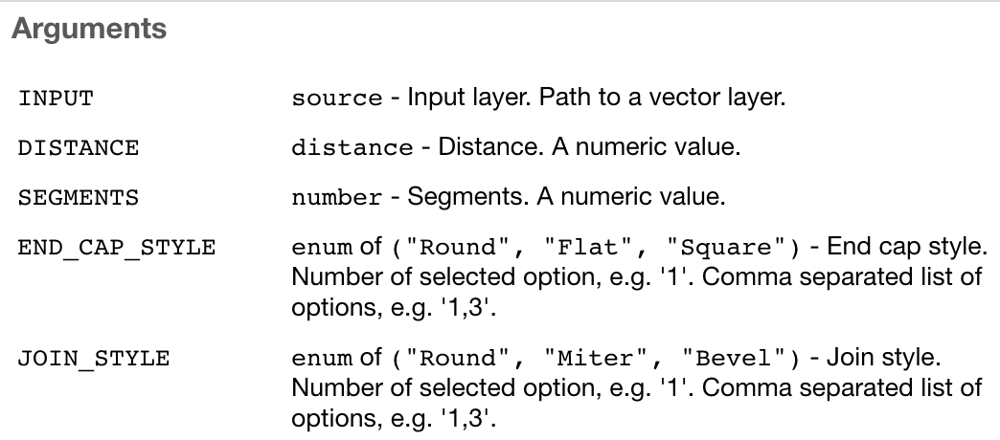

---
# This doesn't get used for the title slide...keep scroling!
title: "Presentation"
output:
  xaringan::moon_reader:
    seal: false
    df_print: paged
    lib_dir: libs
    css:
    - default
    - assets/theme.css
    - assets/theme-xaringan.css
    - presentation.css
    nature:
      highlightStyle: github
      highlightLines: true
      countIncrementalSlides: false
      titleSlideClass: ["theme-xaringan-title-slide", "center", "middle"]
---
class: theme-xaringan-title-slide, center, middle

```{r setup, include=FALSE}
library(sf)

# remotes::install_github("paleolimbot/qgisprocess")

knitr::opts_chunk$set(
  dpi = 200,
  fig.height = 4,
  echo = FALSE
)

# this just has to be here for xaringan to work
options(htmltools.dir.version = FALSE)
```

<!-- this is actually the title slide --->

# Connecting R and QGIS

### Dewey Dunnington

### Fisheries and Oceans Canada

<br/>

<https://fishandwhistle.net/slides/qgisprocess2021>

<!-- this is how you get the parliament hill blue thing on your slide  --->
.landscape[

]

---
class: center, middle


---

# Using qgisprocess

The magic is all from the [`qgis_process` command-line utility](https://docs.qgis.org/3.16/en/docs/user_manual/processing/standalone.html#using-processing-from-the-command-line)! (QGIS >= 3.16)

<br/>

    $ qgis_process
    QGIS Processing Executor - 3.16.10-Hannover 'Hannover' (3.16.10-Hannover)
    Usage: qgis_process [--json] [command] [algorithm id or path to model file] [parameters]

---

# Using qgisprocess

```{r, echo=TRUE}
# remotes::install_github("paleolimbot/qgisprocess")
library(qgisprocess)
```

---

# Using qgisprocess

```{r, echo=TRUE, results='hide', message=FALSE}
library(sf)

nc <- read_sf(system.file("gpkg/nc.gpkg", package = "sf")) %>% 
  st_transform("EPSG:3358") # North Carolina state plane

result <- qgis_run_algorithm(
  "native:buffer",
  INPUT = nc,
  DISTANCE = 100000,
  DISSOLVE = TRUE
)
```

---

# Using qgisprocess

    Running qgis_process run 'native:buffer' \
      '--INPUT=/var/folders/gt/l87wjg8s7312zs9s7c1fgs900000gn/T//RtmpOKFcD5/file607b669acaa1/file607b1aa5ed2f.gpkg' \
      '--DISTANCE=1' '--END_CAP_STYLE=0' '--JOIN_STYLE=0' '--DISSOLVE=TRUE' \
      '--OUTPUT=/var/folders/gt/l87wjg8s7312zs9s7c1fgs900000gn/T//RtmpOKFcD5/file607b669acaa1/file607b376b654.gpkg

---

# Using qgisprocess
      
    ----------------
    Inputs
    ----------------
    
    DISSOLVE:	TRUE
    DISTANCE:	1
    END_CAP_STYLE:	0
    INPUT:	/var/folders/gt/l87wjg8s7312zs9s7c1fgs900000gn/T//RtmpOKFcD5/file607b669acaa1/file607b1aa5ed2f.gpkg
    JOIN_STYLE:	0
    OUTPUT:	/var/folders/gt/l87wjg8s7312zs9s7c1fgs900000gn/T//RtmpOKFcD5/file607b669acaa1/file607b376b654.gpkg
    
    
    0...10...20...30...40...50...60...70...80...90...

---

# Using qgisprocess
    
    ----------------
    Results
    ----------------
    
    OUTPUT:	/var/folders/gt/l87wjg8s7312zs9s7c1fgs900000gn/T//RtmpOKFcD5/file607b669acaa1/file607b376b654.gpkg

---

# Using qgisprocess

```{r, echo=TRUE}
result
```

---

# Using qgisprocess

```{r, echo=TRUE}
output_sf <- sf::read_sf(qgis_output(result, "OUTPUT"))
plot(sf::st_geometry(output_sf))
```

---

# Using qgisprocess

```{r, echo=TRUE, rows.print=8}
qgis_algorithms()
```

---

# Using qgisprocess

```{r, echo=TRUE, eval=FALSE}
qgis_show_help("native:buffer")
```

    Buffer (native:buffer)
    
    ----------------
    Description
    ----------------
    This algorithm computes a buffer area for all the features 
    in an input layer, using a fixed or dynamic distance.
    ...
    ----------------
    Arguments
    ----------------
    ...
    ----------------
    Outputs
    ----------------
    ...

---

# Challenges

```{r, echo=TRUE, eval=FALSE}
qgis_run_algorithm(
  "native:aggregate",
  INPUT = nc,
  AGGREGATES = "???"
)
```

    ERROR:	An error was encountered while checking parameter values
    	Incorrect parameter value for AGGREGATES

---

# Challenges

```{r, echo=TRUE}
system.time(qgis_run("list"))
```

---

# Opportunities

```{r, echo = TRUE, results='hide', message=FALSE}
# remotes::install_github("JanCaha/r_package_qgis")
library(qgis)
result <- qgis_buffer(nc, 100000)
```

```{r, echo = TRUE}
result
```

---

# Opportunities

```{r, echo = TRUE, eval=FALSE}
?qgis_buffer
```



---

# Acknowledgements

- QGIS authors: Nyall Dawson

- qgisprocess collaborators: Jan Caha, Robin Lovelace, Jannes Muenchow, Lorena Abad Crespo, Floris Vanderhaeghe, Antony Barja, Gabo Gaona

- Fisheries and Oceans Canada: Clark Richards, Blair Greenan

---

# Questions?

.landscape[

]
